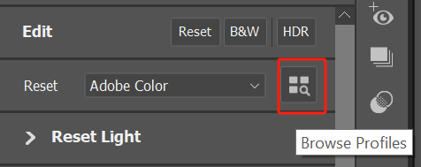
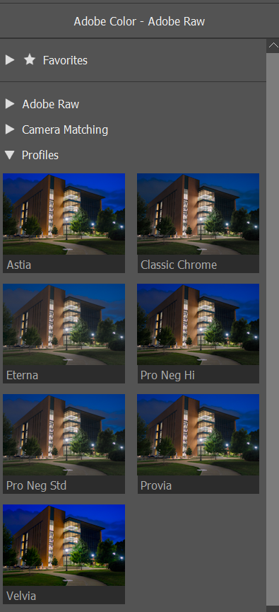

# 🎞 Fuji Film Simulation Creative Profiles for Sony A7C Mark II

This repository provides a set of **Fujifilm-style film simulations** as `.dcp` Creative Profiles, adapted for use on **Sony A7C II** RAW files. These profiles replicate popular Fuji film looks—**Provia, Velvia, Astia, Classic Chrome, Pro Neg Std, Pro Neg Hi, Eterna**—by injecting their color rendering style while preserving your Sony camera’s native color accuracy.

*Note: This only works on RAW files.*

These profiles:
- Apply Fujifilm's LookTable and ToneCurve on top of your Sony RAWs
- Preserve Sony’s native sensor matrices for correct color science
- Show up in **Adobe Camera Raw / Lightroom Classic** as **Creative profiles**
- No EXIF spoofing, no sensor mismatch.  

---

## 📦 What's Included

| Filename | Film Simulation | Description |
|----------|------------------|-------------|
| `Fuji_Provia_Sony.dcp`         | Provia         | Balanced, punchy base look |
| `Fuji_Velvia_Sony.dcp`         | Velvia         | High saturation, vivid tones |
| `Fuji_Astia_Sony.dcp`          | Astia          | Soft contrast, pleasing skin tones |
| `Fuji_ClassicChrome_Sony.dcp`  | Classic Chrome | Vintage, muted tones |
| `Fuji_ProNegStd_Sony.dcp`      | Pro Neg Std    | Neutral portrait studio tone |
| `Fuji_ProNegHi_Sony.dcp`       | Pro Neg Hi     | Higher contrast portrait look |
| `Fuji_Eterna_Sony.dcp`         | Eterna         | Flat cinematic tone curve |

*Note: Those profiles are created by following the procedures in [abpy/FujifilmCameraProfiles](https://github.com/abpy/FujifilmCameraProfiles).*

---

## 🚀 Installation & Usage

### 1. Download or Clone
```bash
git clone https://github.com/TingfengLuo/sony-fuji-creative-profiles.git
```
### 2. Copy .dcp files to the correct profile folder

| OS      | Destination Folder                                              |
| ------- | --------------------------------------------------------------- |
| Windows | `C:\Users\<your-login>\AppData\Roaming\Adobe\CameraRaw\CameraProfiles\`|
| macOS   | `~/Library/Application Support/Adobe/CameraRaw/CameraProfiles/` |

### 3. Relaunch Bridge / Photoshop / Camera Raw (or Lightroom Classic)
Camera Raw only reads the profile folders at launch, so close every Adobe app that uses ACR, then open one again.

### 4. Apply the profiles when editing a Sony A7C II RAW
```
1. Open an A7C II .ARW file.
2. Click the browse profile icon:
```

```
4. Expand Profiles:
```

```
5. Select any of the Fuji profiles to apply
```
